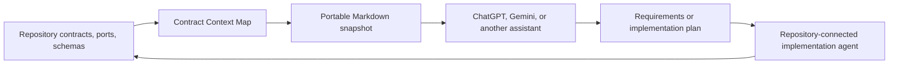

# Contract Context Map

Generate one compact, line-addressable Markdown snapshot from repository contracts, ports, and schemas.

Repository-connected agents can keep implementation access. Web assistants can use generated snapshot to plan features against current domain shapes without receiving full source tree.

## Why this exists

Repository trees show file placement but not data relationships. Full-source exports are large, noisy, slow to refresh, and disclose more implementation than planning usually needs.

Contract Context Map selects only configured semantic files, compacts supported source declarations, and writes one `<repository>_contracts.md` document. Header contains exact line ranges for every extracted module and file.



This creates shared context across tools. Snapshot is current implementation evidence, not source of product requirements or architecture policy.

## Core behavior

- Uses `rg --files` for fast path discovery.
- Reads content only from files that match configured criteria.
- Finds files below `contracts` and `ports` directories by default.
- Includes Prisma, SQL, and generic schema files.
- Ignores tests, dependencies, generated output, builds, and migrations by default.
- Removes TypeScript and JavaScript import noise while preserving declarations.
- Groups extracted files by module.
- Builds verified `L#####-L#####` ranges in `## Content Map`.
- Replaces previous snapshot atomically only after successful rendering.
- Supports standalone repositories, monorepo subprojects, and custom layouts.

## Requirements

- Node.js 20 or newer
- pnpm
- [ripgrep](https://github.com/BurntSushi/ripgrep) available as `rg` on `PATH`

## Quick start

### Run from this repository

```bash
git clone https://github.com/Pareidollya/GET_PROJECT_CONTENT_TXT.git
cd GET_PROJECT_CONTENT_TXT
pnpm install
pnpm extract -- /path/to/your-repository --output /path/to/your-repository/your-repository_contracts.md
```

Windows example:

```powershell
pnpm extract -- "C:\Users\you\Documents\my-repository" --output "C:\Users\you\Documents\my-repository\my-repository_contracts.md"
```

### Embed in another repository

1. Copy `extract_contracts.ts` into target repository, for example `tools/extract_contracts.ts`.
2. Install dependencies:

```bash
pnpm add --save-dev tsx typescript @types/node
```

3. Add package script:

```json
{
  "scripts": {
    "extract:contracts": "tsx tools/extract_contracts.ts"
  }
}
```

4. Run from repository root:

```bash
pnpm extract:contracts -- .
```

Default output is `<repository>_contracts.md` in current working directory.

## CLI

```text
pnpm extract -- <target>
pnpm extract -- <target> --output <file>
pnpm extract -- --config <file>
pnpm extract -- <target> --raw
```

Options:

- `--config <file>` loads JSON overrides.
- `--output <file>` sets snapshot path.
- `--raw` preserves original source formatting.
- `--help` prints command help.

For monorepos, target one subproject at a time:

```bash
pnpm extract -- apps/billing
pnpm extract -- services/notifications
```

Each command produces independent context for corresponding product or assistant workspace.

## Migration from legacy Python exporter

Version 2 replaces `extract.py` tree/full export model:

- Python and hard-coded `TARGET_DIRS` are removed.
- Node.js, TypeScript, pnpm, and ripgrep are now required.
- Positional target and optional JSON replace source edits.
- Full source trees are no longer exported.
- Output changes from large `.txt` dumps to focused, navigable Markdown contract snapshots.

Keep legacy exporter from an older release only when full repository export is intentional.

## Default matching

Contract and port files match supported extensions below directories named:

- `contracts`
- `ports`

Schemas match:

```text
**/*.schema
**/*.schema.*
**/schema.prisma
**/schema.sql
```

Default exclusions cover tests, dependencies, virtual environments, generated files, coverage, build output, and migrations. ripgrep also respects repository ignore rules.

Folders such as `dto`, `entities`, `interfaces`, or project-specific names are not assumed. Add them only when they represent useful semantic context in target repository.

## Configuration

Copy `extract-contracts.example.json` to `extract-contracts.json` and edit only required fields.

```json
{
  "name": "commerce-api",
  "roots": ["."],
  "output": "commerce-api_contracts.md",
  "contractDirectories": ["contracts", "ports", "dto"],
  "excludeGlobs": [
    "**/*.spec.*",
    "**/node_modules/**",
    "**/generated/**",
    "**/internal-only/**"
  ],
  "moduleMarkers": ["modules", "domains"],
  "compact": true
}
```

Supported fields:

- `name`: document title and default filename base.
- `roots`: search roots used without positional target.
- `output`: explicit output path.
- `outputDir`: directory used for default output.
- `contractDirectories`: semantic directory names to include.
- `extensions`: allowed contract and port file extensions.
- `schemaGlobs`: schema patterns.
- `excludeGlobs`: ripgrep exclusion patterns, similar to ignore rules.
- `moduleMarkers`: path segments whose next segment names a module.
- `compact`: TypeScript and JavaScript declaration compaction.

Configuration precedence:

1. built-in defaults;
2. JSON overrides;
3. CLI target, output, and raw-mode overrides.

Arrays replace defaults. Copy required default exclusions when overriding `excludeGlobs`.

`extract-contracts.json` is loaded automatically from current working directory. Use `--config` when file has another name or location.

## Output format

```md
# Contract Context: commerce-api

> Navigation: read `## Content Map`, find relevant module or file, then retrieve only its mapped line range (`L#####-L#####`).

## Content Map

- `database`: L00020-L00090
  - `prisma/schema.prisma`: L00022-L00090
- `orders`: L00092-L00180
  - `src/modules/orders/contracts/order.contract.ts`: L00094-L00120

## orders

### `src/modules/orders/contracts/order.contract.ts`
```

Only modules with matched files appear. Line map is validated before write.

## Example NestJS repository

`dummy_repo` is intentionally non-runnable. It demonstrates selection behavior without framework setup:

- `orders` contains CRUD contracts and a repository port, so it is extracted.
- `health` contains implementation files only, so it is ignored naturally.
- `legacy-billing` contains matching folders but is excluded by configuration.
- `prisma/schema.prisma` is extracted as database context.

Run example and verification:

```bash
pnpm test
```

Generate example without verification:

```bash
pnpm example
```

Review generated [dummy repository snapshot](dummy_repo/dummy_repo_contracts.md) and [fixture configuration](dummy_repo/extractor.config.json).

## Configure an external assistant

Any assistant that accepts Markdown files and persistent instructions can use snapshot. Exact UI and file limits depend on provider and account.

### Reusable instruction

```text
Repository context is provided in a file named <repository>_contracts.md.

For each task:
1. Read document header and ## Content Map first.
2. Identify only modules, schemas, or files relevant to current task.
3. Retrieve only mapped L#####-L##### ranges for those sections.
4. Expand to another mapped range only when a referenced type or relationship is unresolved.
5. Treat extracted content as current implementation evidence, not product requirements or mandatory architecture.
6. Separate observed repository facts from proposed changes.
7. Ask for regenerated snapshot when recent changes appear missing or evidence conflicts.

Do not read full document unless task spans most mapped domains or targeted ranges cannot resolve needed context.
```

Example request:

```text
Plan order cancellation. Use attached contract snapshot. Read Content Map first, then inspect only orders and related database ranges. List existing states, relationships, constraints, missing product decisions, and proposed contract changes.
```

Same instruction works as system prompt, project instruction, custom instruction, agent rule, or reusable prompt in other providers.

## Suggested workflows

### Manual refresh

Recommended default. Run extractor before planning new feature or after accepted implementation changes. This avoids repeated repository scans during unrelated commits.

### Package command

Keep stable repository command:

```json
{
  "scripts": {
    "context:update": "tsx tools/extract_contracts.ts ."
  }
}
```

### Git hook

Run only when changed paths include configured contract directories or schemas. Avoid unconditional commit or push hooks on large repositories. Hook should call normal package command and never duplicate extraction logic.

### CI artifact

Generate snapshot in CI after merge, store it as workflow artifact, or publish it to approved documentation storage. Review security policy before publishing repository-derived context.

### Helper agent

Give repository-connected agent one narrow task: run extractor, verify warnings, and return updated snapshot. Planning assistant remains independent from source access.

### Scheduled refresh

For active repositories, run extractor on schedule only when contract or schema paths changed since previous run. Keep scheduling outside extractor so core interface stays portable.

## Compaction

TypeScript and JavaScript files use TypeScript compiler parser. Compact output removes imports, re-exports, declaration modifiers, trailing semicolons, excess indentation, and repeated blank lines. It preserves declarations, literal unions, nested shapes, methods, constants, and comments.

Other supported text formats preserve source meaning. Only line endings, trailing whitespace, and repeated blank lines are normalized.

Use `--raw` when exact formatting matters.

## Safety and limits

- Snapshot may contain internal data shapes or business rules. Review before external sharing.
- Extractor does not include environment files by default, but matched source comments may still contain sensitive data.
- Gitignored and hidden files are not discovered by default.
- Generated line ranges become invalid after manual document edits. Regenerate instead.
- TypeScript and JavaScript receive semantic compaction; other languages receive text normalization only.
- Tool does not infer architecture, requirements, runtime behavior, or correctness.
- Empty, binary, and invalid UTF-8 files are skipped with warnings.
- Existing snapshot remains unchanged after discovery, parsing, rendering, or write failure.

## Development

```bash
pnpm install
pnpm run typecheck
pnpm test
```

Contributions should keep default selection conservative, CLI small, output deterministic, and map ranges exact.